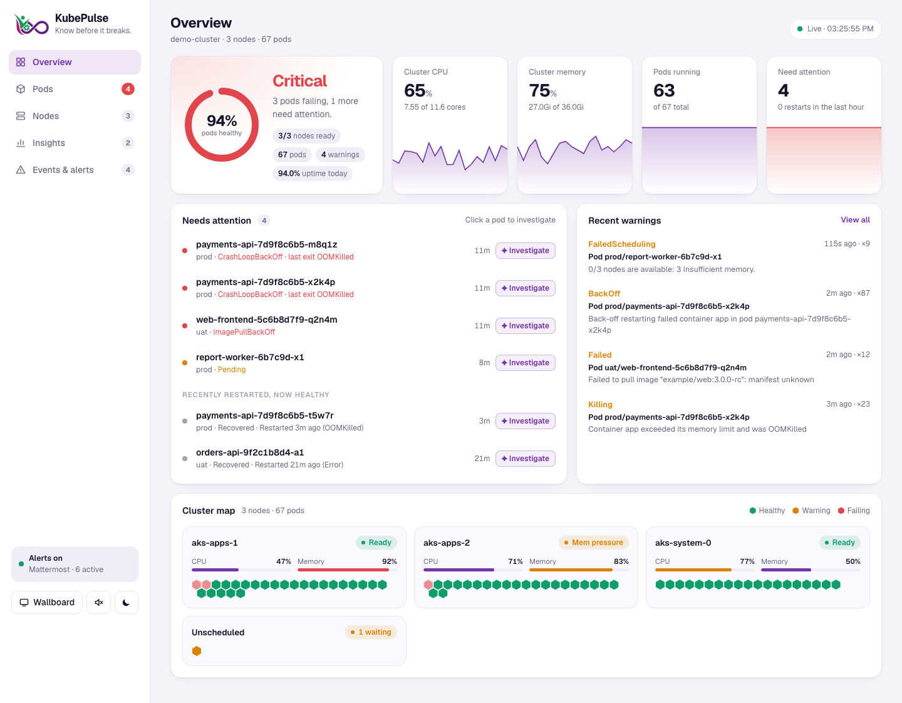
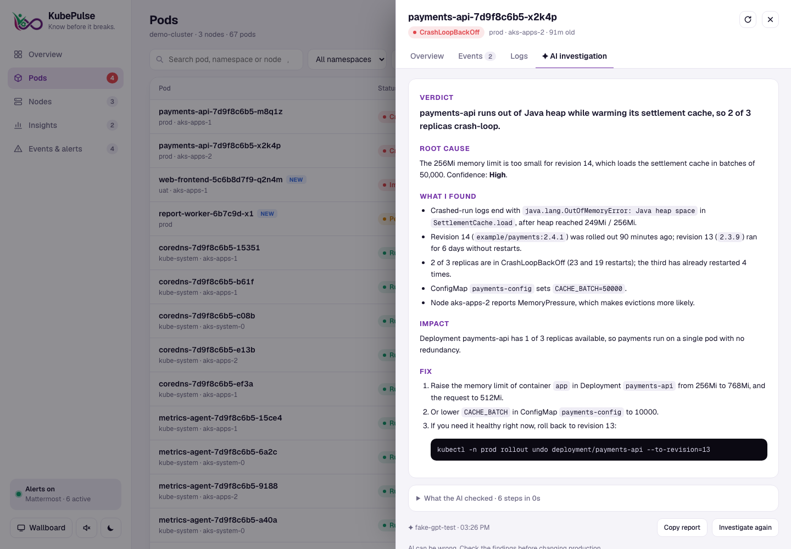
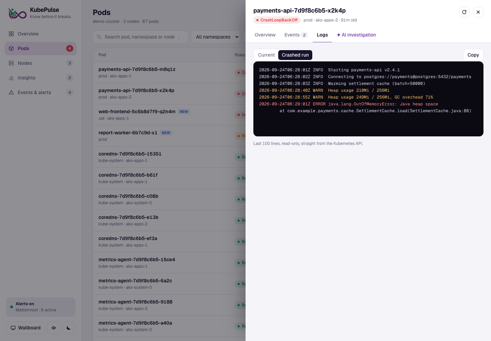
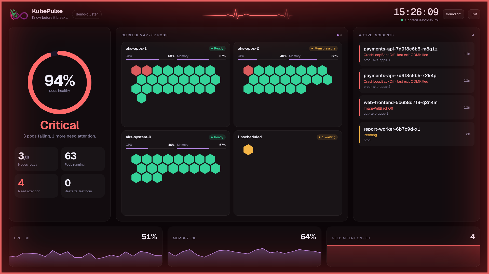
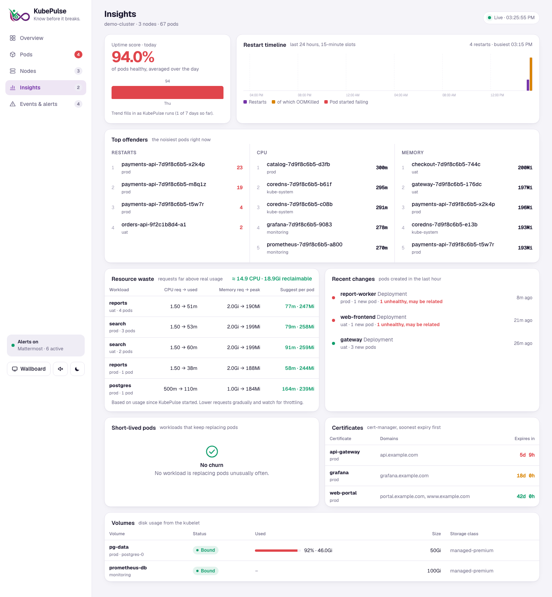
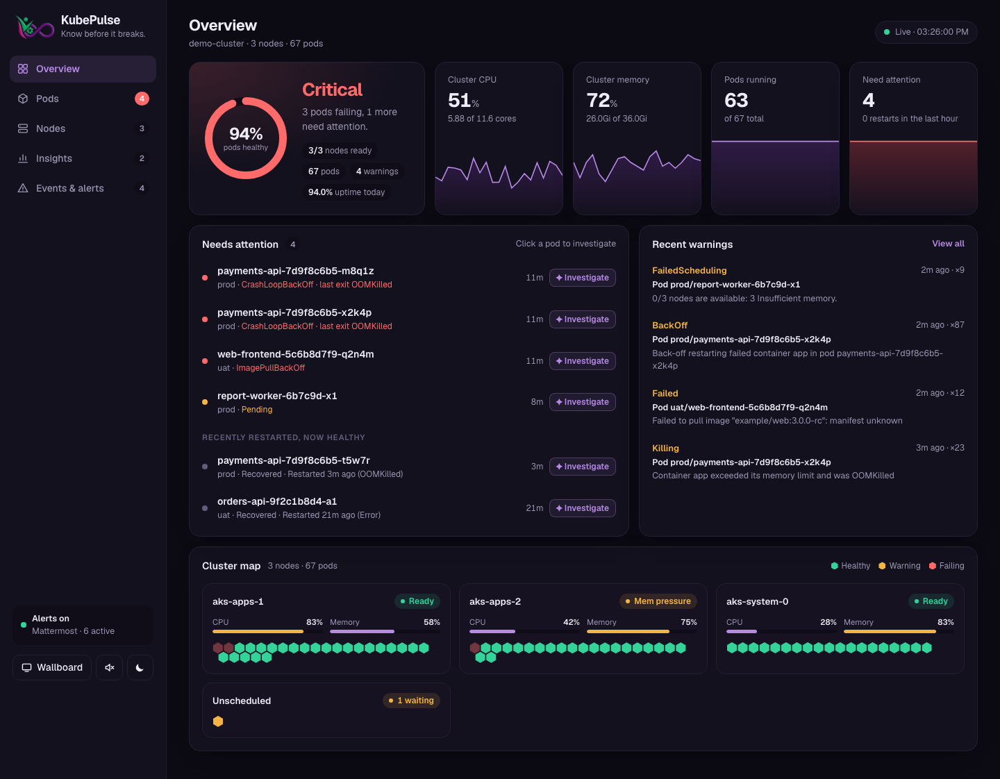

<p align="center"></p>

<h1 align="center">KubePulse</h1>
<p align="center"><b>Know before it breaks.</b><br>
A small, read-only Kubernetes dashboard with a live cluster map, a NOC wallboard, Mattermost alerts and AI root-cause investigation.</p>

<p align="center">
  
  
  
  
</p>



KubePulse is one Python file (standard library only) and one HTML page. It runs in your cluster with
a read-only service account, uses about 15 MiB of memory, and works on EKS, AKS, GKE and plain
Kubernetes. The screenshots use demo data.

## Features

**See the cluster at a glance**
- Health score, cluster CPU / memory / pod trends, and a list of what needs attention right now
- A honeycomb **cluster map**: every node as a card, every pod as a hexagon, coloured by status; failing pods blink
- Pods, Nodes and Events pages with search and filters. The URL keeps your filters, so `/#pods?ns=prod&problems=1` is a link you can share

**Understand why a pod is failing**
- Click any pod for a plain-language reason (OOMKilled, image pull errors, failed scheduling, crash loops), its events, and the logs of the current or **crashed** run
- **AI investigation**: the AI works like an on-call engineer. It reads the logs, checks the owning Deployment and its recent rollouts, compares sibling pods, checks the node, services / endpoints and the ConfigMaps and volumes the pod uses, then reports the verdict, evidence, impact and the exact fix. Read-only; passwords, tokens and keys are removed before anything is sent

**Spot patterns**
- **Insights**: 24-hour restart timeline, daily uptime score with a 7-day trend, top offenders by restarts / CPU / memory, **resource waste** (requests far above real usage, with suggested values), recent changes (new pods and rollouts), short-lived pods, cert-manager certificate expiry and PVC usage

**Get told when something breaks**
- **Mattermost alerts** for failing pods, pods stuck pending or not ready, OOM kills, nodes going NotReady, certificates about to expire, volumes filling up, and recoveries. Each problem alerts once; flapping problems are held back
- **Wallboard / NOC mode** for an office TV: big status, heartbeat line, the map and a 24-hour view that rotate, active incidents, and the whole screen turns red when something is critical
- Optional **sound**: a monitor beep when a pod starts failing, a flatline when a node goes down, a chime when everything recovers. Browsers only allow audio after a click, so after a reload the wallboard shows *Tap to enable sound*

**Keyboard**: `/` search · `p` problems only · `t` theme · `f` wallboard · `s` sound · `1`–`5` pages · `?` help

## Screenshots

| AI investigation | Crashed-run logs |
|---|---|
|  |  |

**Wallboard (NOC mode)**, scaled to fit any screen from a laptop to a 4K TV:



| Insights | Dark mode |
|---|---|
|  |  |

## Quick start

```bash
kubectl apply -f kubepulse.yaml
kubectl -n kubepulse port-forward svc/kubepulse 8080:80
# open http://localhost:8080
```

That's all you need. Mattermost alerts and AI investigation are optional; see below.
The image `christoj/kubepulse` is published for `linux/amd64` and `linux/arm64`.

**Keep your real config out of git**: copy `kubepulse.yaml` to `kubepulse.local.yaml`, put your
webhook URL, API key and hostnames in the copy, and deploy that. `*.local.yaml` is in `.gitignore`.

## Configuration

Set these in the Deployment in `kubepulse.yaml`. Every setting is optional.

| Variable | Default | What it does |
|---|---|---|
| `CLUSTER_NAME` | empty | Shown on the dashboard, wallboard and in alerts |
| `DASHBOARD_URL` | empty | Your KubePulse URL, so alerts link straight to the pod |
| `NAMESPACES` | all | Comma-separated list to limit what KubePulse sees, e.g. `prod,uat` |
| `POLL_SECONDS` | `20` | How often KubePulse reads the cluster |
| `ALERT_PENDING_MINUTES` | `3` | Alert on pods pending or not ready for this long |
| `ALERT_COOLDOWN_MINUTES` | `30` | Don't re-alert a problem that comes back within this window |
| `ALERT_RESOLVED` | `true` | Also post when a problem recovers |
| `CERT_WARN_DAYS` | `14` | Alert when a certificate expires within this many days |
| `PVC_WARN_PERCENT` | `85` | Alert when a volume is this full (needs `PVC_STATS`) |
| `PVC_STATS` | `false` | Read disk usage per PVC from the kubelet (see Permissions) |
| `OPENAI_MODEL` | `gpt-4o-mini` | Model used for AI investigation |
| `OPENAI_BASE_URL` | OpenAI | Any OpenAI-compatible chat completions API |
| `AI_MAX_STEPS` | `8` | Maximum tool-calling rounds per investigation |

Secrets go in the `kubepulse-secrets` Secret:

| Key | What it does |
|---|---|
| `MATTERMOST_WEBHOOK_URL` | Incoming webhook for alerts. Use **Send test message** on the Events & alerts page to check it |
| `OPENAI_API_KEY` | Turns on AI investigation |

**Using Claude instead of OpenAI**: Anthropic offers an OpenAI-compatible endpoint. Set
`OPENAI_BASE_URL=https://api.anthropic.com/v1`, an Anthropic key in `OPENAI_API_KEY`, and
`OPENAI_MODEL=claude-sonnet-5`. (Not tested yet.)

The pod needs outbound HTTPS to Mattermost and to the AI provider.

## Exposing it

`kubepulse.yaml` includes an optional nginx Ingress that serves KubePulse under a path such as
`https://kubepulse.example.com/kubepulse`. The page works at any path prefix.

> **KubePulse has no login**, and the Logs tab shows raw container logs. Keep it behind
> `kubectl port-forward`, a VPN, or an authenticating proxy (nginx basic auth, oauth2-proxy)
> before exposing it on the internet.

## Permissions

KubePulse is read-only. It can't change anything in the cluster and it can't read Secrets.

| Resource | Why |
|---|---|
| pods, nodes, events, pod logs | Dashboard, pod details, logs |
| deployments, replicasets, statefulsets, daemonsets, jobs, cronjobs | AI investigation: owning workload and rollouts |
| services, endpoints, configmaps, persistentvolumeclaims | AI investigation and volume list |
| metrics.k8s.io | CPU and memory usage (needs metrics-server) |
| cert-manager.io certificates | Certificate expiry |
| nodes/proxy *(off by default)* | PVC disk usage. This is a powerful permission, so it's commented out |

## How it works

```
Kubernetes API ──► background poller (every POLL_SECONDS) ──► in-memory snapshot ──► browsers
                         │                                         (gzip + ETag)
                         ├─► trend history, insights  (small emptyDir, survives restarts)
                         └─► Mattermost alerts
```

- One background thread reads the cluster from the API server's cache (`resourceVersion=0`); every browser gets the same in-memory result, so opening more tabs adds no load on the cluster
- Browsers stop polling when their tab is hidden; an unchanged snapshot costs a 304
- Certificates and PVCs are refreshed every 5 minutes
- AI investigations run as a tool-calling loop over the read-only tools in `app.py`

## Development

```bash
kubectl proxy --port=8001 &
K8S_API=http://127.0.0.1:8001 DATA_DIR=/tmp python3 app.py
# open http://localhost:8080
```

Build and push a multi-arch image:

```bash
docker buildx create --name multiarch --driver docker-container --use   # once
docker buildx build --platform linux/amd64,linux/arm64 -t <you>/kubepulse:<tag> --push .
```

## Limitations

- Trend history and the uptime score live in memory plus a small emptyDir: they survive container restarts but reset if the pod moves to another node. The 7-day trend fills in as KubePulse runs
- One KubePulse per cluster
- Certificate expiry comes from cert-manager only, because KubePulse doesn't read TLS Secrets
- metrics-server is needed for CPU and memory (on by default in AKS; install it on EKS)

---

<p align="center">Made by the <b>Lifetrenz DevOps team</b></p>
