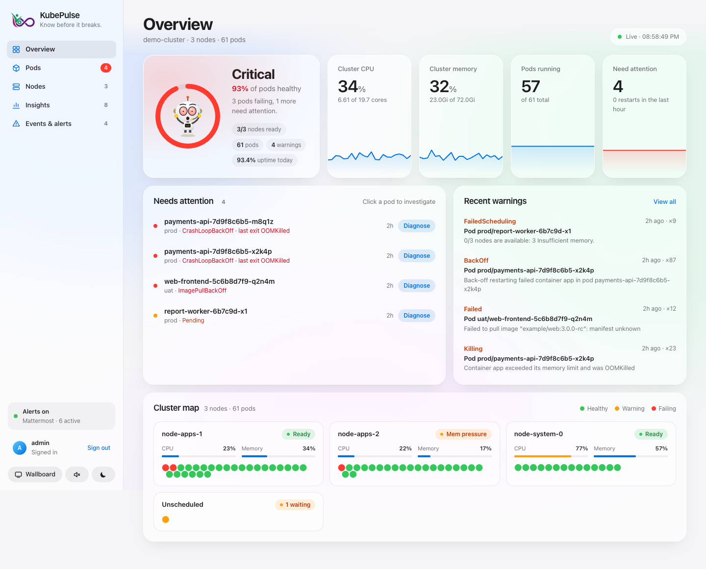
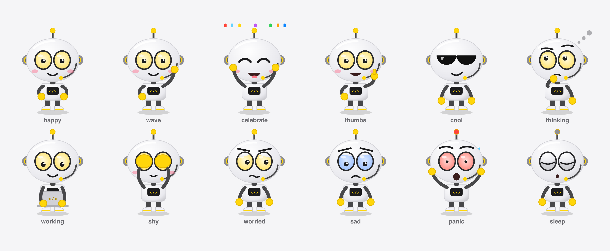
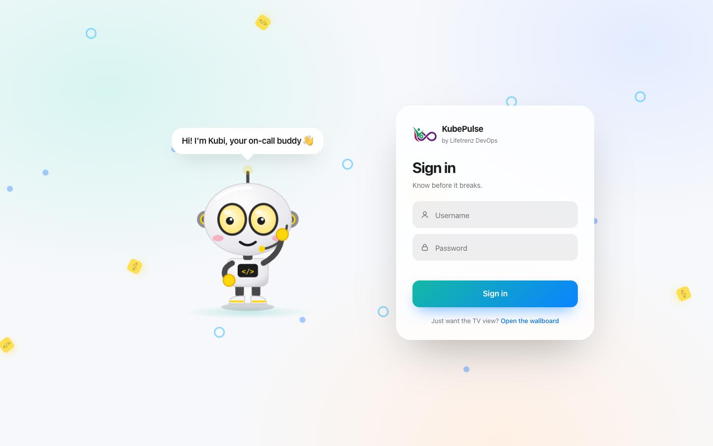
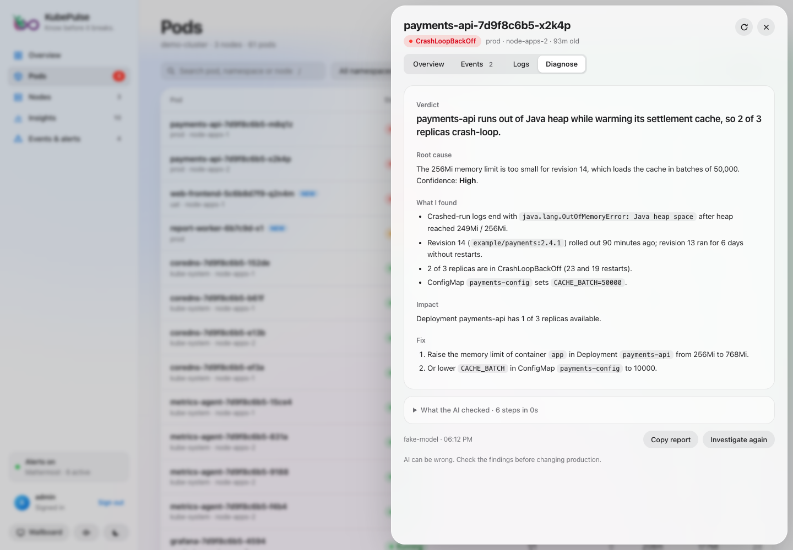
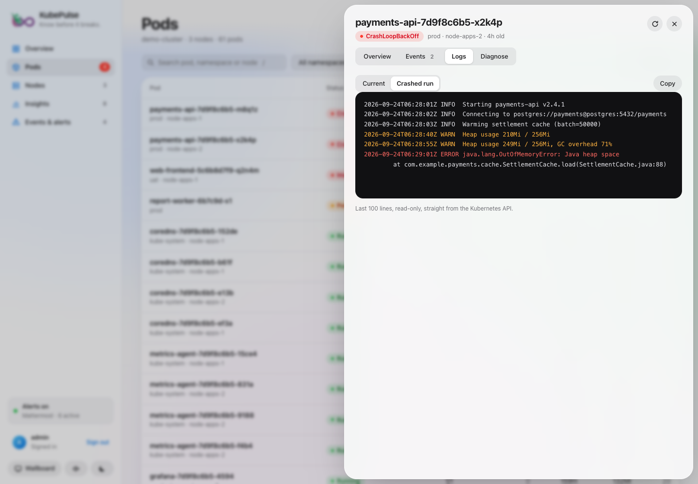
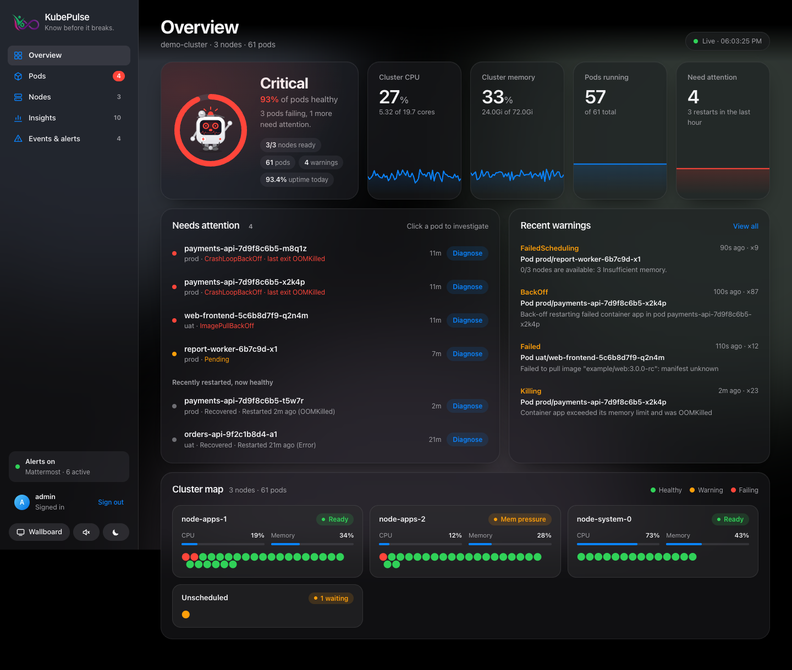
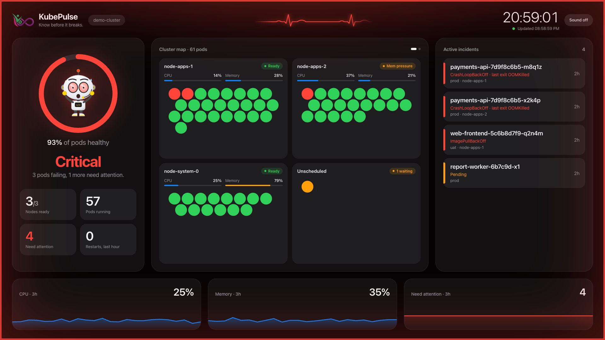
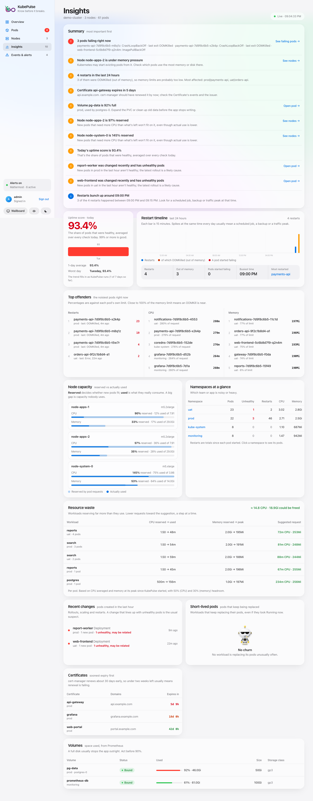

<p align="center"></p>

<h1 align="center">KubePulse</h1>
<p align="center"><b>Know before it breaks.</b><br>
A calm, read-only Kubernetes dashboard with a live cluster map, a NOC wallboard, Mattermost alerts and AI root-cause diagnosis.</p>

<p align="center">
  
  
  
  
</p>



KubePulse is one Python file (standard library only) and one HTML page. It runs in your cluster with
a read-only service account, uses about 15 MiB of memory, and works on EKS, AKS, GKE and plain
Kubernetes. The screenshots use demo data.

## Features

**See the cluster at a glance**
- Health score, cluster CPU / memory / pod trends, and a list of what needs attention right now
- **Kubi**, a little robot IT engineer with glowing yellow eyes and a headset, has an expression for every moment: grinning when the cluster is healthy, sweating when it's degraded, panicking when it's critical, asleep when data is stale, celebrating when all is clear, and thinking or typing away while he diagnoses a pod
- A **cluster map**: every node as a card, every pod as a dot, coloured by status; failing pods breathe red
- **Resource utilization per pod**: CPU and memory used, shown as a percentage of the pod's request and of its limit, in the pods table and the pod panel (with the 24-hour peak)
- Pods, Nodes and Events pages with search and filters. The URL keeps your filters, so `/#pods?ns=prod&problems=1` is a link you can share

**Understand why a pod is failing**
- Click any pod for a plain-language reason (OOMKilled, image pull errors, failed scheduling, crash loops), its events, and the logs of the current or **crashed** run
- **Diagnose** (AI) works like an on-call engineer. It reads the logs, checks the owning Deployment and its recent rollouts, compares sibling pods, checks the node, services / endpoints and the ConfigMaps and volumes the pod uses, then reports the verdict, evidence, impact and the exact fix. Read-only; passwords, tokens and keys are removed before anything is sent

**Spot patterns**
- **Insights** starts with a plain-language *Summary*, most serious first, each item linked to the pod or page to look at. Below it:
  a 24-hour restart timeline with the numbers behind it, a daily uptime score with a 7-day trend, top offenders (with usage against each pod's own limits),
  node capacity (reserved vs used), namespaces at a glance, **resource waste** with suggested requests,
  recent changes, short-lived pods, cert-manager certificate expiry, and **volumes with the space actually used** (from Prometheus)

**Know what changed**
- **Rollout tracking**: every new version of a Deployment, StatefulSet or DaemonSet, with what changed (image `2.4.0 → 2.4.1`, resources, environment, restart) and how its pods are doing now. Rollouts show as dashed lines on the restart timeline, and a crashing pod's alert says "🚀 Rolled out 6m ago · app: 2.4.0 → 2.4.1"
- Mattermost gets 🚀 when a rollout starts and ⚠️ when one is followed by failing pods or doesn't finish in 15 minutes

**A daily or weekly digest in Mattermost** 📬: uptime, restarts (and which workloads), rollouts, what's broken right now, certificates and volumes running out, the busiest pods, and waste worth fixing. Sent at `DIGEST_TIME` in `DIGEST_TIMEZONE`; **Send today's digest now** on the Events & alerts page

**Get told when something breaks**
- **Mattermost alerts** for failing pods, pods stuck pending or not ready, OOM kills, nodes going NotReady, certificates about to expire, volumes filling up, and recoveries. Each problem alerts once; flapping problems are held back. Every kind of problem has its own emoji (🧠 out of memory, 🔁 crash loop, 📦 image pull, ⏳ pending, 🖥️ node, 🔐 certificate, 💾 volume), and recoveries arrive as ✅ All clear 🎉. Alerts link straight to the pod in KubePulse and use readable reasons ("Startup probe failed: /actuator/health timed out", not raw messages with pod IPs). When a pod goes into **CrashLoopBackOff** or is **OOMKilled**, a short 🤖 **AI analysis** follows the alert: the likely cause, the log line that shows it, and the fix
- **Wallboard / NOC mode** for an office TV at `/wall`: big status with Kubi, a heartbeat line, the map, a 24-hour restart view and the **top CPU and memory users of the last 24 hours** rotating, active incidents, and the whole screen turns red when something is critical. If the data goes stale, the board greys out behind a clear warning instead of showing old numbers as live
- Optional **sound**: a monitor beep when a pod starts failing, a flatline when a node goes down, a chime when everything recovers. Browsers only allow audio after a click, so after a reload the wallboard shows *Tap to enable sound*

**Signed in, except the TV**
- A sign-in page protects everything: pods, logs, events and diagnosis. It's a single clean card with Kubi peeking over the top: he greets you, covers his eyes while you type your password, looks sad when it's wrong and celebrates when you're in.

**Keyboard**: `/` search · `p` problems only · `t` theme · `f` wallboard · `s` sound · `1`–`5` pages · `?` help

## Screenshots

**Meet Kubi.** One robot, twelve moods, each used where it fits.



| Sign in | Diagnose |
|---|---|
|  |  |

| Crashed-run logs | Dark mode |
|---|---|
|  |  |

**Wallboard (NOC mode)** at `/wall`, scaled to fit any screen from a laptop to a 4K TV:



**Insights**



## Quick start

```bash
kubectl apply -f kubepulse.yaml
kubectl -n kubepulse port-forward svc/kubepulse 8080:80
kubectl -n kubepulse logs deploy/kubepulse | grep "Sign in as"   # the generated admin password
# open http://localhost:8080 and sign in; the TV link is http://localhost:8080/wall
```

That's all you need. Set your own users, Mattermost alerts and AI diagnosis in the Secret; see below.
The image `christoj/kubepulse` is published for `linux/amd64` and `linux/arm64`.

**Keep your real config out of git**: copy `kubepulse.yaml` to `kubepulse.local.yaml`, put your
passwords, webhook URL, API key and hostnames in the copy, and deploy that. `*.local.yaml` is in `.gitignore`.

## Configuration

Set these in the Deployment in `kubepulse.yaml`. Every setting is optional.

| Variable | Default | What it does |
|---|---|---|
| `CLUSTER_NAME` | empty | Shown on the dashboard, wallboard and in alerts |
| `DASHBOARD_URL` | learned | Your KubePulse URL for links in alerts. If empty, KubePulse uses the address it was opened at by a signed-in user |
| `NAMESPACES` | all | Comma-separated list to limit what KubePulse sees, e.g. `prod,uat` |
| `POLL_SECONDS` | `20` | How often KubePulse reads the cluster |
| `WALLBOARD_PUBLIC` | `true` | Serve the wallboard at `/wall` without sign-in. `false` makes it need a sign-in too |
| `SESSION_HOURS` | `12` | How long a sign-in lasts |
| `AUTH` | `on` | `off` turns sign-in off entirely, e.g. behind your own single sign-on proxy |
| `ALERT_PENDING_MINUTES` | `3` | Alert on pods pending or not ready for this long |
| `ALERT_COOLDOWN_MINUTES` | `30` | Don't re-alert a problem that comes back within this window |
| `ALERT_RESOLVED` | `true` | Also post when a problem recovers |
| `CERT_WARN_DAYS` | `14` | Alert when a certificate expires within this many days |
| `PVC_WARN_PERCENT` | `85` | Alert when a volume is this full |
| `PROMETHEUS_URL` | auto | Where to read volume usage. Found automatically (e.g. `prometheus-operated`); set it if yours has an unusual name |
| `PVC_STATS` | `false` | Without Prometheus, read volume usage from the kubelet instead (see Permissions) |
| `OPENAI_MODEL` | `gpt-4o-mini` | Model used for diagnosis |
| `OPENAI_BASE_URL` | OpenAI | Any OpenAI-compatible chat completions API |
| `AI_MAX_STEPS` | `8` | Maximum tool-calling rounds per diagnosis |
| `DEPLOY_ALERTS` | `true` | Post rollouts to Mattermost, and warn when one is followed by failing pods |
| `DIGEST` | `daily` | `daily`, `weekly` or `off` |
| `DIGEST_TIME` | `09:00` | When to send the digest (24-hour clock) |
| `DIGEST_DAY` | `mon` | Day for the weekly digest |
| `DIGEST_TIMEZONE` | `UTC` | Time zone for `DIGEST_TIME`, e.g. `Asia/Kolkata` |
| `AI_ALERTS` | `true` | Post a short AI analysis after CrashLoopBackOff alerts (needs `OPENAI_API_KEY`) |
| `AI_ALERTS_PER_HOUR` | `10` | Most AI analyses sent per hour, so a big outage can't run up the bill |

Secrets go in the `kubepulse-secrets` Secret:

| Key | What it does |
|---|---|
| `ADMIN_PASSWORD` | The admin password, set straight in the YAML (username `ADMIN_USER`, default `admin`) |
| `KUBEPULSE_USERS` | Who can sign in: `admin:password,ops:another`. Empty = a random `admin` password, printed once in the pod log (it changes on every restart) |
| `SESSION_SECRET` | Any long random string (`openssl rand -hex 32`). Keeps people signed in when KubePulse restarts |
| `MATTERMOST_WEBHOOK_URL` | Incoming webhook for alerts. Use **Send test message** on the Events & alerts page to check it |
| `OPENAI_API_KEY` | Turns on AI diagnosis |

**Using Claude instead of OpenAI**: Anthropic offers an OpenAI-compatible endpoint. Set
`OPENAI_BASE_URL=https://api.anthropic.com/v1`, an Anthropic key in `OPENAI_API_KEY`, and
`OPENAI_MODEL=claude-sonnet-5`. (Not tested yet.)

The pod needs outbound HTTPS to Mattermost and to the AI provider, and access to Prometheus inside the cluster for volume usage.

## Exposing it

`kubepulse.yaml` includes an optional nginx Ingress that serves KubePulse under a path such as
`https://kubepulse.example.com/kubepulse`. The page works at any path prefix, and the TV link is
that path plus `/wall`.

Everything except the wallboard needs a sign-in, so set `KUBEPULSE_USERS` to your own passwords
before exposing it. Sign-in uses a signed, HttpOnly cookie (Secure over HTTPS), and ten wrong
passwords from one address lock it out for ten minutes. For company-wide single sign-on, put an
authenticating proxy such as oauth2-proxy in front and set `AUTH=off`.

## Permissions

KubePulse is read-only. It can't change anything in the cluster and it can't read Secrets.

| Resource | Why |
|---|---|
| pods, nodes, events, pod logs | Dashboard, pod details, logs |
| deployments, replicasets, statefulsets, daemonsets, jobs, cronjobs | Diagnosis: owning workload and rollouts |
| services, endpoints, configmaps, persistentvolumeclaims | Diagnosis, volume list, finding Prometheus |
| metrics.k8s.io | CPU and memory usage (needs metrics-server) |
| cert-manager.io certificates | Certificate expiry |
| nodes/proxy *(off by default)* | Volume usage when there's no Prometheus. A powerful permission, so it's commented out |

## How it works

```
Kubernetes API ──► background poller (every POLL_SECONDS) ──► in-memory snapshot ──► signed-in browsers
                         │                                  └─► trimmed copy ──► public wallboard (/wall)
                         ├─► trend history, insights  (small emptyDir, survives restarts)
                         └─► Mattermost alerts
```

- One background thread reads the cluster from the API server's cache (`resourceVersion=0`); every browser gets the same in-memory result, so opening more tabs adds no load on the cluster
- Browsers stop polling when their tab is hidden; an unchanged snapshot costs a 304
- Certificates and volumes are refreshed every 5 minutes
- Diagnosis runs as a tool-calling loop over the read-only tools in `app.py`

## Development

Against a real cluster:

```bash
kubectl proxy --port=8001 &
K8S_API=http://127.0.0.1:8001 DATA_DIR=/tmp KUBEPULSE_USERS=admin:dev python3 app.py
# open http://localhost:8080
```

Without a cluster, `dev/fake_cluster.py` serves a fake Kubernetes API with failing pods, a scripted
AI model and a Mattermost webhook that prints what it receives. `dev/screenshots.mjs` retakes the
README screenshots with headless Chrome:

```bash
python3 dev/fake_cluster.py &
K8S_API=http://127.0.0.1:8911 DATA_DIR=/tmp KUBEPULSE_USERS=admin:demo \
  OPENAI_API_KEY=x OPENAI_BASE_URL=http://127.0.0.1:8912/v1 MATTERMOST_WEBHOOK_URL=http://127.0.0.1:8913/hook python3 app.py
node dev/screenshots.mjs docs/screenshots http://localhost:8080
```

Build and push a multi-arch image:

```bash
docker buildx create --name multiarch --driver docker-container --use   # once
docker buildx build --platform linux/amd64,linux/arm64 -t <you>/kubepulse:<tag> --push .
```

## Limitations

- Trend history, the uptime score, restarts, rollouts and the digest date are kept on a 1 GiB volume (`kubepulse-data`), so they survive restarts and the pod moving. The 7-day trend fills in as KubePulse runs
- Rollouts are detected while KubePulse is running; a rollout that happens while it's down isn't recorded
- One KubePulse per cluster
- Certificate expiry comes from cert-manager only, because KubePulse doesn't read TLS Secrets
- metrics-server is needed for CPU and memory (on by default in AKS; install it on EKS)

---

<p align="center">Made by Lifetrenz DevOps team ❤️</p>
